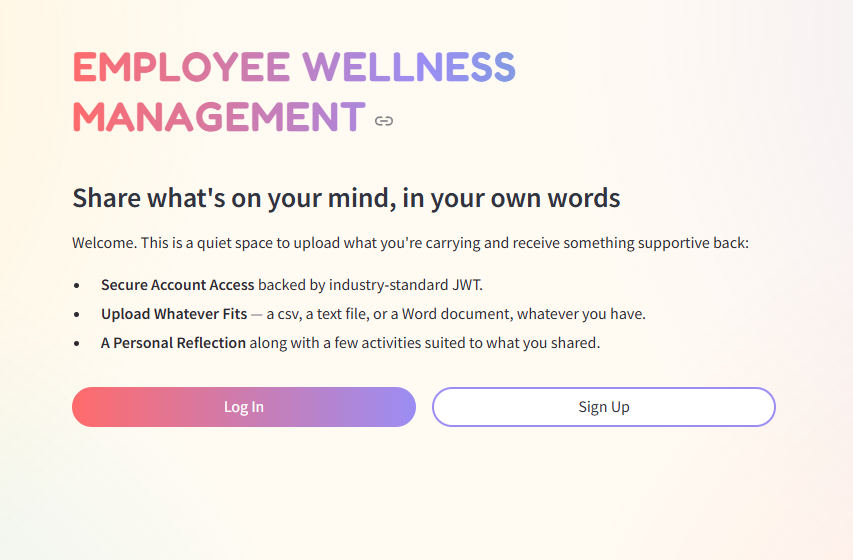
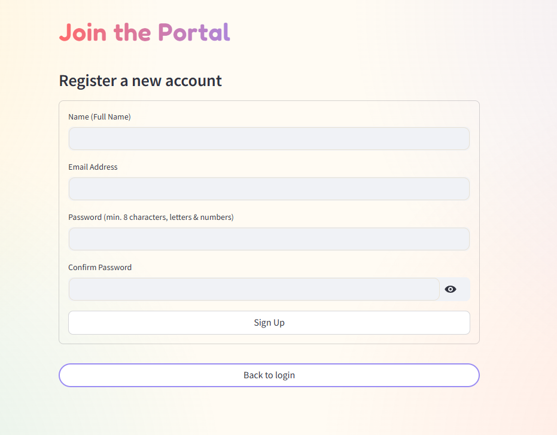
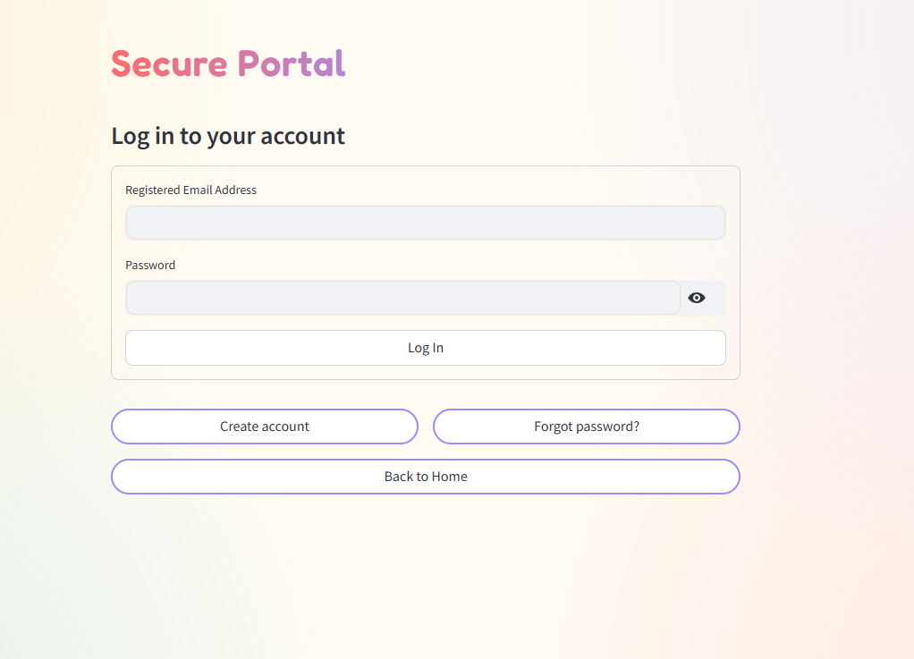
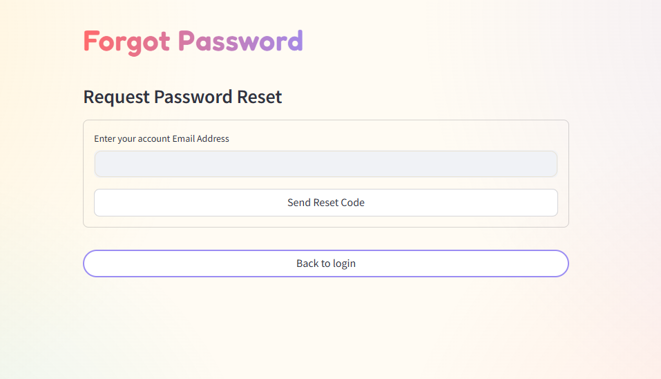
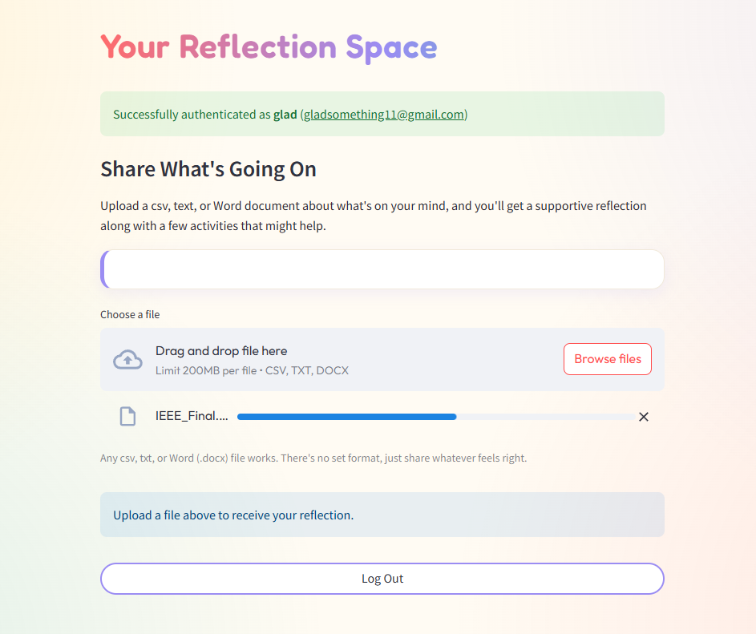
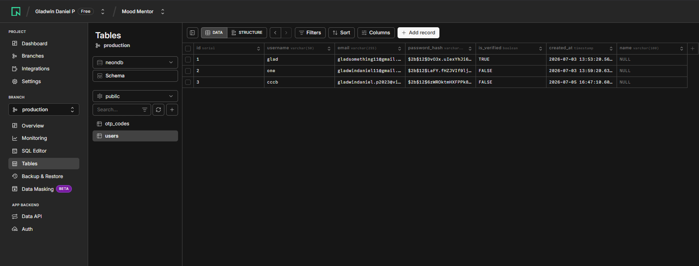
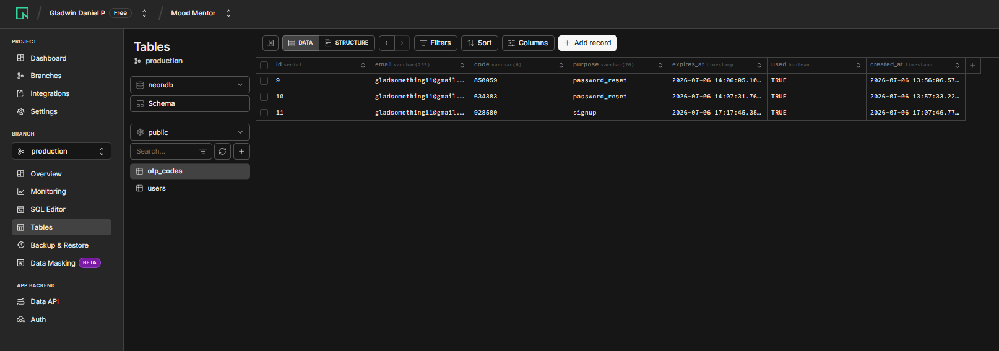

# Employee Wellness Management - Reflect & Support Portal

A secure, modern, and interactive employee wellness portal built with **Streamlit**, **PostgreSQL (Neon)**, and **Google Colab**. This application, named **Reflect & Support**, provides a quiet, secure space for employees to upload files detailing what is on their mind, receiving empathetic reflections and tailored wellness activities.

---

##  Features

- **Secure Account Access**: Industry-standard authentication backed by **JSON Web Tokens (JWT)**.
- **Verification & Password Reset (OTP)**: Two-factor registration verification and secure password reset utilizing 6-digit OTP codes sent via **Gmail SMTP (STARTTLS)**.
- **Local Console Fallback**: Safe local testing mode that prints OTP codes to the console if SMTP credentials are not configured.
- **Reflection Space**: An interactive dashboard supporting uploads of `.csv`, `.txt`, and `.docx` documents. 
- **Document Text Extraction**: Automatic extraction of uploaded file text using libraries like `python-docx` and `pandas`.
- **Emotional Support reflection**: Generates warm reflections and customized wellness activities based on user input.
- **Playful Design & Fluid UX**: Beautiful, custom CSS styling including a responsive gradient background, custom Google Fonts (`Outfit` & `Fredoka`), and bouncy micro-animations.
- **Robust PostgreSQL Backend**: Schemas for managing users and OTP codes, with indexes optimized for fast lookups.

---

---

## 🛠️ Tech Stack & Dependencies

- **Frontend**: [Streamlit](https://streamlit.io/) (v1.38.0)
- **Database**: PostgreSQL hosted on [Neon](https://neon.tech/)
- **Secure Tunneling**: [pyngrok](https://github.com/alexdlaird/pyngrok)
- **Authentication**: `PyJWT` (v2.9.0), `bcrypt` (v4.2.0)
- **Utilities**: `python-dotenv` (v1.0.1), `email-validator` (v2.2.0), `python-docx` (v1.2.0), `pandas`, `psycopg2-binary` (v2.9.9)

---

##  Environment Variables & Setup

The application loads secrets from a `.env` file or directly from Google Colab's Secrets manager.

| Variable Name | Description | Example / Details |
|---|---|---|
| `DB_HOST` | Neon PostgreSQL host URL | `ep-xxxx.us-east-2.aws.neon.tech` |
| `DB_PORT` | Database Port | `5432` |
| `DB_NAME` | Database Name | `neondb` |
| `DB_USER` | Database Username | `neondb_owner` |
| `DB_PASSWORD` | Database Password | `your_db_password` |
| `JWT_SECRET` | Secret key for signing session tokens | Any long random string |
| `SMTP_EMAIL` | Sender email address for OTP | `example@gmail.com` |
| `SMTP_APP_PASSWORD` | 16-character Gmail App Password | `xxxx xxxx xxxx xxxx` |
| `NGROK_AUTHTOKEN` | Tunneling authentication token | From [Ngrok Dashboard](https://dashboard.ngrok.com/) |

---

##  Getting Started

### 1. Database Setup
The app automatically runs database table initializations on startup. The schema consists of two main tables:
*   `users`: Stores username, email, name, password hash, verification status, and creation timestamps.
*   `otp_codes`: Tracks the 6-digit verification and password-reset OTP codes, expiration time, usage status, and purpose.

### 2. Running via Google Colab
All application modules (`db.py`, `auth.py`, `email_utils.py`, `app.py`) are packaged and managed within the interactive notebook `authentication&dashboard.ipynb`.

1. Open `Milestone1/authentication&dashboard.ipynb` in Google Colab.
2. Add your secrets to the Google Colab sidebar under the **Secrets** (key) icon.
3. Run the setup cells to automatically install the pip dependencies, write the script files, and establish the PostgreSQL tables.
4. Launch the Streamlit server cell; the notebook will output a secure public URL provided by `ngrok`.
5. Open the `ngrok-free.dev` link to interact with the application.

---

## Screenshots & Visual Walkthrough

### App User Experience

#### 1. Home / Landing Page
The portal welcomes users with a clean, light-themed splash screen prompting to log in or register.

#### 2. Sign Up & Registration
Users can register an account with their full name, email, and password. Standard validations ensure proper formatting.

#### 3. Secure Portal Login
Allows users to securely authenticate and initiates a JWT-signed session.

#### 4. Forgot / Reset Password Flow
Secure password recovery workflow utilizing OTP codes.

#### 5. Reflect & Support Dashboard
Once logged in, users can upload documents to receive emotional reflections and actionable recommendations.

### Database Schemas

#### Users Table
Successfully verified and created accounts are stored in the relational database.

#### OTP Codes Table
Tracks OTP code history, expiration, and status.

---

##  License
This project is licensed under the [MIT License](LICENSE) - see the [LICENSE](LICENSE) file for details.
Copyright (c) 2026 Gladwin Daniel.
